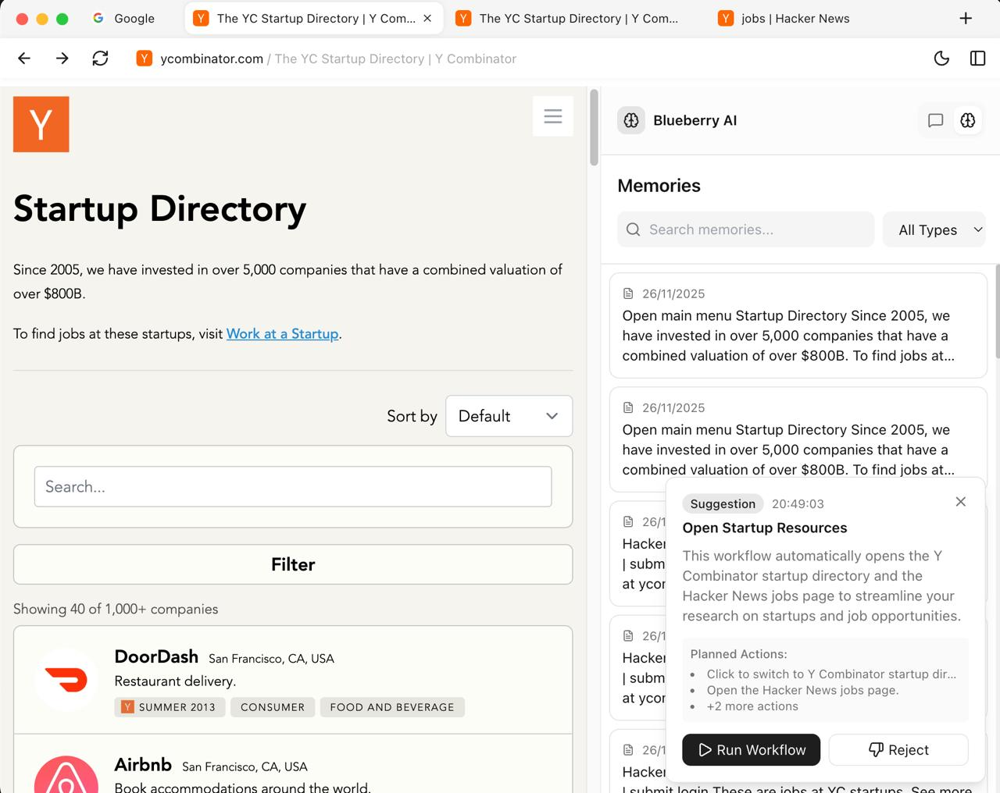

# Blueberry Browser


https://github.com/user-attachments/assets/f80e6522-25ab-415a-ae9a-0377e875b28b


---

## Overview

This is a POC for a proactive autonomous browser agent which suggests user's actions based on their browser usage.



## Approach

1. Memory Layer: Base layer for memory which combines vector (RxDb) DB for embeddings and structured (Dexie.js) SQL-like datastores:
   1. SQL rows store reference to embeddings. (denormalised for this MVP)
   2. improvements: a\) 2-way mapping 1:1 map (Rows --- Embeddings) b\) Use Graph DBs to store both structure and semantics.
2. Store browser trace into the memory layer.
   1. The browser stores chats, opened tabs, history into the memory layer which is used to generate action suggestions
3. The browser runs a periodic CRON, to retrieve the browser trace, current chat memory to prompt an LLM to generate actions
4. These actions are then suggested to users based on

### Detailed Structure:

#### [High Level Overview, Architecture](docs/project-overview.md#memory--persistence-layer)

#### [Low Level Structure and Design](https://deepwiki.com/cryptus-neoxys/blueberry-arch)

## 💡 Features

### **Autonomous Action Engine**

Learning from the user's browser usage, the browser periodically suggests actions in the sidebar to be performed. Users don't even need to prompt for any browser actions, they just use the browser and it automatically infers, learns and does things for them.

### **Browser Trace Compiler**

Track the things that the user is doing inside the browser and figure out from a series of browser states what the user is doing, and perhaps how
valuable, repetitive tasks can be re-run by an AI agent.

Tracks Chats, History, Open Tab(s) -> Input to LLMs -> Action

### **Tab Group organiser**

Automagically re-organise the tabs from usage patterns.

### **Gemini Computer Usage**

Implemented a PoC CU that leverages Blueberry to automate work.

Current Actions Supported:

1. navigate
2. perform click actions
3. fill forms
4. re-organise tabs

## Known Gaps

- Doesn’t use a battle tested frameworks like Langgraph/Langgraph for its action model:
  - prompt and action models need a lot more refining and testing to be productionised.
- ⁠Lifecycle management of chats, embedddings, actions
  - The chats are persistent throughout the browser session, they are never deleted or archived which can cause memory/storage issues, bottlenecks in performance in a production environment.

## Future Scope:

- We currently only learn from inputs to the suggestion-engine like chats, history, open tabs, etc, for improving the suggestions we can learn user’s behaviour from the action on these prompts as well to make them better personalised to the user
- Blackbox reranking of browser actions, for this assignment I didn’t make the mathematical heuristics for reranking the suggestions ie whether 5 open tabs to be grouped should be the better suggestion or Revisiting a daily website is decided by the LLM, but these can be made to more deterministic with some fundamental ML (maths)
- ⁠Easiest Local RLHF, it already has "Run Workflow", "Reject" mechanisms built-in :D
- Cost Optimisation 💸 🔥 (basically caching, local models, intelligently not using LLMs where local models/ML/logic etc can be used)

---

## 🚀 Project Setup

### Install

```bash
$ pnpm install
```

### Development

```bash
$ pnpm dev
```
